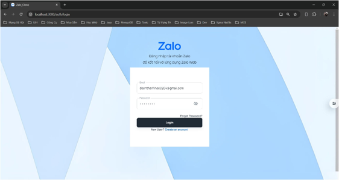

# ZaloApp Clone
  ### <i>My Role: Backend Developer</i>
  <i>Contact: davidduongxu1@gmail.com</i>
#### Members size: 5

#### Technologies Used:
- Frontend: React, Material-UI, Ant Design, Cloudinary, Socket.io.
- Backend: NodeJS, ExpressJS, JWT, Reactive Mongo
- Deployment: AWS(S3), Firebase Storage, MongoDB Clusters(DB)
#### Descriptions:
- Implemented features such as user login and registration, friend requests, direct messaging, and group chat.
- Developed and implemented user-friendly interfaces using React Native, ensuring a seamless user experience.
- Integrated real-time chat functionality using Socket.io for instant messaging capabilities.

# Image Demo
## LoginPage

## HomePage

## ChatPage
### Chat 1-1

### Chat Group

